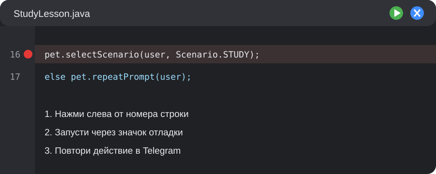

# Magic Pet — walkthrough 1–10

Рабочий Telegram-бот для пробного урока Pixel Point Studio. Пользователь выбирает один из трёх путей, называет питомца, формулирует цель, получает персональный или резервный план из трёх задач и развивает питомца выполнением заданий.

## Требования

- JDK 21 или новее;
- Telegram-бот и токен от [@BotFather](https://t.me/BotFather).

Gradle отдельно устанавливать не нужно: wrapper включён в репозиторий.

## Что сегодня происходит

Ты не создаёшь бот с нуля: ты дорабатываешь существующий продукт. В выбранном маршруте есть четыре небольших [GitHub Issues](https://github.com/Pixel-Point-Studio/trial-lesson-magic-pet/issues) — два видимых бага и две функции. На одном уроке достаточно качественно решить один баг и одну функцию.

Если встретишь слово `callback`, это внутреннее имя нажатой Telegram-кнопки. `Fallback` — заранее подготовленный резервный план, который работает без AI и сети.

## С чего начать ученику

1. Открой ссылку на выбранный GitHub Issue, которую дал МОП.
2. Выполни `git status` и `git branch --show-current`: начальный статус должен быть чистым, а имя ветки начинаться с `lesson/`.
3. Открой свой небольшой файл: `StudyLesson.java`, `SportLesson.java` или `BlogLesson.java` в каталоге [`lesson/route`](src/main/java/studio/pixelpoint/magicpet/lesson/route).
4. Найди блок `ISSUE` с номером своей задачи и следуй подсказкам из GitHub.
5. Не изменяй каталоги `infrastructure`, `db/migration`, `.env` и бинарные ассеты без указания МОПа.

Постановки задач живут только в GitHub. Теория, ответы, сетап и troubleshooting собраны в [единой методичке МОПа](https://www.notion.so/3e16ba2ce4e8801a9c67c1830814439b).

## Как повторить проблему и поставить breakpoint

Выполни пользовательские шаги из карточки Issue. Затем нажми слева от номера указанной строки в IntelliJ: появится красная точка. Запусти `Magic Pet` через значок жука, повтори действие в Telegram и посмотри фактические значения переменных.



## Как добавить кнопку

У кнопки есть видимая подпись и внутреннее имя действия. Добавь `new Button(...)` в `taskButtons`, затем сравни внутреннее имя в `handleButton` и вызови готовое действие продукта. Соседний рабочий маршрут можно использовать как пример.

## Как проверить только свою задачу

Скопируй команду из раздела «Проверка в терминале» GitHub Issue. Она запускает одну проверку и не показывает ошибки оставшихся задач. Полная проверка выбранного маршрута не обязана проходить, пока три другие учебные задачи ещё не решены.

## Как посмотреть свои изменения

В терминале выполни `git diff`. Зелёные строки добавлены, красные удалены. Стартовый учебный набор уже сохранён отдельным commit, поэтому diff показывает только твою работу. Перед commit убедись, что менялся только учебный файл, указанный в Issue.

## Подготовка отдельного занятия

Из чистой ветки `main`:

```bash
./scripts/prepare-lesson.sh "Имя Фамилия" study
```

Маршрут обязателен: `study`, `sport` или `blog`. Скрипт создаёт отдельную ветку и worktree, чистые `.env`/`data`, применяет один учебный patch, сохраняет его отдельным стартовым commit и выводит путь, четыре GitHub Issues и ссылку на методичку МОПа.

Техническая проверка подготовки и полная автоматическая приёмка:

```bash
./scripts/test-prepare-lesson.sh
./scripts/final-acceptance.sh
```

`final-acceptance.sh` намеренно запускается только из чистого commit ветки `main`. Ручные замеры Telegram и урока фиксируются в [`acceptance/PILOT-REPORT.md`](acceptance/PILOT-REPORT.md). Полный порядок подготовки, восстановления и завершения урока находится в [методичке МОПа](https://www.notion.so/3e16ba2ce4e8801a9c67c1830814439b).

## Запуск

1. Создайте локальный файл конфигурации:

   ```bash
   cp .env.example .env
   ```

2. Вставьте токен в `.env` вместо `replace_me`.
   Чтобы включить AI-планы, также задайте `LLM_API_URL` и при необходимости `LLM_API_KEY`/`LLM_MODEL`.
   Для урока оставьте `APP_MODE=lesson`; только этот режим включает безопасную команду `/reset`.
3. Запустите приложение:

   ```bash
   ./gradlew run
   ```

   В IntelliJ тот же запуск доступен одной кнопкой через общую конфигурацию `Magic Pet`.

4. Откройте бота в Telegram и отправьте `/start`.

Если токен не задан, приложение завершится с инструкцией и не выведет секреты в консоль.

## Проверка

```bash
./gradlew test
./scripts/verify-lesson-patches.sh
```

Сквозной тест проходит путь от `/start` до 100 XP и уровня 2. Отдельные тесты проверяют SQLite, все сочетания ассетов, AI-контракт, timeout/fallback и защиту от повторной доставки callback.

## Что входит в walkthrough 1–10

- Java 21 и Gradle 9.2.1;
- TelegramBots 10.3.0, long polling;
- SQLite-хранилище с миграциями Flyway;
- восстановление состояния onboarding, плана, задач и XP после перезапуска;
- изоляция пользователей по Telegram ID и транзакционное завершение задач;
- постоянная защита от повторной доставки callback;
- отдельные PNG для всех сочетаний сценария и уровней 1–3;
- проверка PNG-сигнатуры, общий визуальный и текстовый fallback;
- опциональная генерация плана через школьный HTTP-прокси;
- строгая проверка AI-ответа, безопасные правила для спорта и локальный fallback при любой ошибке;
- сохранение источника каждой задачи: `AI` или `FALLBACK`;
- создание, просмотр, завершение и удаление собственных задач;
- отдельные списки активных и выполненных задач с проверкой владельца;
- централизованная проверка конфигурации и безопасные логи без секретов;
- изоляция ошибок отдельных Telegram update и ограниченный retry подключения;
- восстановление после временной блокировки SQLite и понятная ошибка повреждённой базы;
- безопасный `/reset`, выключенный по умолчанию и доступный только в режиме урока;
- три независимых учебных маршрута с четырьмя задачами каждый;
- проверяемые patch-файлы, breakpoint-сценарии, лестница подсказок и отдельные ответы МОПа;
- подготовка изолированного lesson-worktree одной командой;
- preflight Java/Gradle/ассетов/секретов и автоматическая проверка трёх маршрутов;
- независимые порты `TelegramGateway`, `UserStore`, `PlanGenerator`, `AssetCatalog`;
- три локальных плана без сетевого AI;
- 50 XP за задачу; уровень 2 открывается на 100 XP, уровень 3 — на 250 XP;
- русские тексты и AI-контракт в отдельных JSON-ресурсах;
- строгая карта PNG: сначала `assets/<scenario>/level-<n>.png`, затем `assets/common/fallback.png`, а при отсутствии обоих показывается текст.

## Известные ограничения

- фактический формат школьного AI-прокси нужно сверить с временным контрактом в `ai-proxy-contract.md`;
- без `LLM_API_URL` бот намеренно использует локальные планы;
- включённые демонстрационные PNG имеют исходный размер 1254×1254; перед финальным пилотом их нужно экспортировать в требуемые 1024×1024;
- ручной smoke требует действующего Telegram-токена и доступа к Telegram.

## Эксплуатационная безопасность

- `/start` не удаляет существующий прогресс, а повторяет текущую подсказку;
- `/reset` полностью начинает путь заново только при `APP_MODE=lesson`;
- `TELEGRAM_RETRY_ATTEMPTS` ограничен диапазоном 1–10;
- `TELEGRAM_RETRY_DELAY_MS` ограничен диапазоном 0–30000;
- сообщения исключений, токены, цели и AI-промпты не выводятся в безопасный лог;
- при недоступном AI автоматически используется локальный план;
- при отсутствующем или повреждённом PNG используется общий файл либо текстовая карточка.
