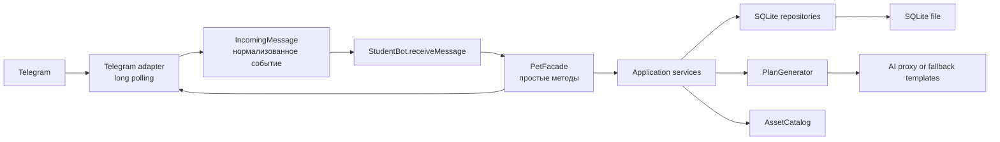

<aside>
⚙️

**Статус:** техническая спецификация v0.1. Цель — собрать надёжный локальный MVP для открытого урока, а не производственную платформу.

</aside>

Продуктовые требования: Продуктовая спецификация — «Magic Pet, который растёт вместе с тобой».

## 1. Техническая цель

Локальное Java-приложение подключается к Telegram-боту через токен из .env, принимает сообщения и callback-кнопки, хранит состояние каждого Telegram-пользователя в SQLite, получает план заданий через абстрагированный AI-клиент и отправляет текст, кнопки и статические изображения Magic Pet.

Сложные детали должны быть закрыты инфраструктурными адаптерами и фасадом. Во время урока лид работает почти исключительно с одним файлом и небольшим набором методов.

## 2. Базовый стек

- Java 21 как исходная базовая версия; перед разработкой сверить с версией основного курса.
- **Gradle** для сборки и зависимостей.
- **TelegramBots** — Java-библиотека поверх официального Telegram Bot API, режим long polling. Все классы библиотеки изолируются внутри Telegram-адаптера и не появляются в учебном коде.
- SQLite как локальная база данных.
- JDBC-драйвер SQLite.
- **Flyway** для версионированных SQL-миграций SQLite.
- Java HttpClient или отдельный клиент для обращения к общему AI-прокси школы, связанному со школьным аккаунтом ChatGPT/OpenAI.
- dotenv-библиотека или собственный безопасный загрузчик .env.
- JUnit для автоматических тестов.
- Статические **PNG-ассеты** Magic Pet.

Точные версии зависимостей фиксируются в Gradle после короткого технического spike.

## 3. Схема компонентов



## 4. Принцип учебной поверхности

Лид не должен видеть:

- Telegram Update, CallbackQuery и детали HTTP;
- SQL-запросы и соединения;
- JSON AI-провайдера;
- файловые пути ассетов;
- миграции и транзакции;
- обработку повторных Telegram-событий;
- секреты и ключи.

Лид видит:

- нормализованное входящее сообщение;
- текст сообщения и идентификатор нажатой кнопки;
- понятные if/else;
- кнопки с человекочитаемыми названиями;
- методы уровня продукта: выбрать сценарий, запросить цель, составить план, завершить задачу, показать прогресс.

## 5. Предлагаемая структура проекта

```
src/main/java/
  lesson/
    StudentBot.java              # основной файл урока
  application/
    PetFacade.java          # простой API для StudentBot
    OnboardingService.java
    PlanService.java
    ProgressService.java
  domain/
    User.java
    Pet.java
    Goal.java
    Task.java
    Scenario.java
    UserState.java
    ProgressResult.java
  infrastructure/
    telegram/
    sqlite/
    ai/
    assets/
src/main/resources/
  db/migration/
  fallback-plans/
assets/
  study/level-1.png
  study/level-2.png
  sport/level-1.png
  sport/level-2.png
  blog/level-1.png
  blog/level-2.png
.env.example
```

## 6. Нормализованное сообщение

Telegram-адаптер преобразует любое входящее событие в простой объект:

```java
public record IncomingMessage(
        long userId,
        String displayName,
        String text,
        String buttonId
) {
    public boolean isCommand(String command) { ... }
    public boolean buttonPressed(String id) { ... }
    public boolean hasText() { ... }
}
```

Идентификатор пользователя всегда берётся из проверенного Telegram-события. Он не читается из текста или callback-data.

## 7. Учебный API

Фасад предоставляет небольшой стабильный набор методов. Предварительный вариант:

```java
UserView getOrCreateUser(long userId, String displayName);
void sendText(long userId, String text);
void sendButtons(long userId, String text, Button... buttons);
Button button(String id, String label);
void showScenarioChoice(long userId, Button... scenarioButtons);
void selectScenario(long userId, Scenario scenario);
void askForPetName(long userId);
void namePet(long userId, String name);
void askForGoal(long userId);
PlanView createPlan(long userId, String goalText);
TaskView getCurrentTask(long userId);
ProgressResult completeCurrentTask(long userId);
void showCurrentTask(long userId);
void showPet(long userId);
void showProgress(long userId, ProgressResult result);
```

Методы могут внутри работать с Telegram, SQL, AI и ассетами, но их названия должны читаться как последовательность пользовательского сценария.

## 8. Пример файла, который видит лид

Точный код будет проверен на пилоте, но учебная поверхность должна выглядеть примерно так:

```java
public void receiveMessage(IncomingMessage message) {
    long userId = message.userId();
    getOrCreateUser(userId, message.displayName());

    if (message.isCommand("/start")) {
        showScenarioChoice(userId,
                button("scenario:study", "📚 Учёба"),
                button("scenario:sport", "🔥 Спорт"),
                // button("scenario:blog", "🦊 Личный блог")
        );
        return;
    }

    // Задание 1: добавить обработку выбранного сценария.

    if (message.buttonPressed("action:task_done")) {
        ProgressResult result = completeCurrentTask(userId);
        showProgress(userId, result);
        return;
    }

    // Остальные шаги сценария вызывают заранее подготовленные методы.
}
```

Этот пример не является финальной реализацией: до пилота нужно проверить, сколько веток новичок способен удержать и какие части лучше раскрывать последовательно.

## 9. Обязательные действия лида

1. Раскомментировать или создать кнопку третьего сценария.
2. Написать одно условие для нажатой кнопки.
3. Внутри условия вызвать метод выбора сценария и следующий метод сценария.
4. Добавить или раскомментировать вызов completeCurrentTask.
5. Творчески изменить видимую деталь: название кнопки, имя способности, текст реакции или фразу эволюции.
6. Перед каждым запуском объяснить МОПу ожидаемое поведение.

Ограничение: в учебном файле одновременно должно быть не больше 3–4 незавершённых участков.

## 10. Состояния пользователя

Минимальная конечная машина состояний:

- NEW — пользователь ещё не начал;
- CHOOSING_SCENARIO — выбирает путь;
- WAITING_PET_NAME — вводит имя Magic Pet;
- WAITING_GOAL — формулирует цель;
- PLAN_READY — план создан, можно показать первое задание;
- ACTIVE — пользователь выполняет задания;
- PLAN_COMPLETED — задания текущего плана закончились.

Состояние хранится в SQLite, поэтому перезапуск приложения не сбрасывает путь пользователя.

## 11. Модель данных SQLite

### users

- id — внутренний первичный ключ;
- telegram_user_id — уникальный Telegram ID;
- display_name — отображаемое имя;
- state — текущее состояние сценария;
- created_at, updated_at.

### pets

- id;
- user_id — уникальный внешний ключ на users;
- name;
- scenario — STUDY, SPORT или BLOG;
- experience — целое число, по умолчанию 0;
- level — целое число, по умолчанию 1;
- created_at, updated_at.

### goals

- id;
- user_id;
- scenario;
- goal_text;
- status — ACTIVE или COMPLETED;
- created_at, completed_at.

### tasks

- id;
- user_id;
- goal_id;
- position — порядок в плане;
- title;
- description;
- xp_reward — в MVP всегда 50;
- status — PENDING или COMPLETED;
- source — AI или FALLBACK;
- created_at, completed_at.

### flyway_schema_history

Служебная таблица создаётся и поддерживается Flyway. Собственную таблицу версий не реализуем.

Все внешние ключи включены. Для одного пользователя допускается только одна активная цель и один Magic Pet.

## 12. Изоляция пользователей

- Корнем пользовательского контекста является telegram_user_id.
- При первом сообщении создаётся запись users; при последующих находится существующая.
- Каждый запрос к цели, заданиям и Magic Pet выполняется с внутренним user_id.
- Callback-data не содержит доверенного user_id.
- Перед завершением задания проверяется, что задание принадлежит текущему пользователю.
- Два пользователя одного школьного бота не видят и не меняют данные друг друга.
- Сценарий изоляции обязательно покрывается интеграционным тестом.

## 13. XP и повышение уровня

- Каждое задание пилота награждает 50 XP.
- Уровень вычисляется программой: 1 при 0–99 XP, 2 при 100 XP и выше.
- Завершение задания и начисление XP происходят в одной транзакции.
- Повторное нажатие на кнопку уже завершённого задания не начисляет XP повторно.
- Если уровень изменился, ProgressResult содержит флаг levelUp и новый путь к ассету.
- Ассет выбирается по паре scenario + level.

В MVP уровень также сохраняется в базе для простоты чтения и отображения, но сервис проверяет его согласованность с XP.

## 14. Генерация плана через AI

Интерфейс:

```java
public interface PlanGenerator {
    GeneratedPlan generate(Scenario scenario, String goalText);
}
```

AI получает только сценарий, очищенный текст цели и ограничения плана. Telegram ID, username и токен не передаются.

Ожидаемый структурированный результат:

```json
{
  "summary": "Короткое описание пути",
  "tasks": [
    {"title": "Шаг 1", "description": "Действие на 1–3 минуты"},
    {"title": "Шаг 2", "description": "Действие на 1–3 минуты"},
    {"title": "Шаг 3", "description": "Следующий шаг после урока"}
  ]
}
```

Программа валидирует:

- наличие ровно трёх задач;
- непустые заголовки и описания;
- ограничение длины;
- отсутствие неожиданных полей, если используется строгая схема;
- соответствие выбранному сценарию;
- безопасный характер спортивных заданий.

XP не принимается из AI-ответа и назначается приложением.

При таймауте, ошибке JSON, нарушении схемы или небезопасном содержании вызывается FallbackPlanGenerator.

## 15. Резервные планы

Для каждого сценария хранится минимум один локальный шаблон из трёх заданий. Он должен давать тот же продуктовый результат, включая повышение уровня после первых двух шагов.

Fallback включается автоматически и не требует вмешательства лида. Пользователь получает нейтральное сообщение вроде: «Архив Magic Pet подготовил проверенный маршрут».

## 16. Кнопки и callback-data

Системные идентификаторы не зависят от отображаемого текста:

- scenario:study;
- scenario:sport;
- scenario:blog;
- action:task_done;
- action:show_task;
- action:show_pet;
- action:restart — только если будет включён безопасный пользовательский сброс.

Лид может менять подпись кнопки, не ломая маршрутизацию.

## 17. Конфигурация

Пример .env.example:

```jsx
TELEGRAM_BOT_TOKEN=replace_me
LLM_API_URL=https://school-proxy.example/api
LLM_API_KEY=replace_me
LLM_MODEL=replace_me
DATABASE_PATH=./data/pet.db
ASSET_DIRECTORY=./assets
APP_MODE=lesson
```

Требования:

- .env включён в .gitignore;
- токены не печатаются в консоль и не попадают в исключения;
- при отсутствии TELEGRAM_BOT_TOKEN приложение завершается с понятной инструкцией;
- школьные запасные токены выдаются из пула: один активный урок — один токен;
- после урока запасной токен ротируется или отзывается;
- токен, созданный лидом, остаётся только на локальной машине и не отправляется в AI или аналитику.

### Миграции Flyway

- SQL-файлы находятся в `src/main/resources/db/migration`.
- Начальная схема создаётся миграцией `V1__initial_schema.sql`.
- Flyway запускается при старте приложения до создания репозиториев.
- Каждое изменение схемы добавляется новым неизменяемым файлом `V2__...sql`, `V3__...sql` и далее.
- Применённые миграции не редактируются задним числом.
- Интеграционный тест создаёт пустую временную SQLite-базу и применяет к ней все миграции.

## 18. Работа без личного Telegram

Подготовить:

- школьный Telegram-аккаунт на отдельном устройстве или в Telegram Desktop;
- пул уникальных тестовых ботов и токенов;
- таблицу занятости токенов;
- чистый профиль или диалог перед каждым уроком;
- инструкцию ротации токена после занятия.

Нельзя запускать два long-polling приложения с одним токеном одновременно: они будут конкурировать за обновления.

### Подготовка проекта для нового лида

Публичная точка входа — задача Visual Studio Code `Magic Pet: подготовить пробный урок`. Она одинаково доступна на macOS, Windows и Linux, не спрашивает имя студента и не требует заранее выбирать тему. Задача вызывает внутреннюю Gradle-задачу `prepareLesson`.

Gradle-задача:

1. Проверяет, что исходная ветка `main` существует и рабочее дерево не содержит незакоммиченных изменений.
2. Создаёт уникальный идентификатор занятия по времени запуска.
3. Создаёт новую ветку вида `lesson/session-дата-время` от учебной ветки `main`.
4. Создаёт отдельный Git worktree для этой ветки, чтобы `.env`, SQLite и файлы одного занятия не попадали в следующее.
5. Копирует `.env.example` в новый локальный `.env` без Telegram-токена.
6. Создаёт чистый каталог `data`; Flyway создаёт базу при первом запуске.
7. Оставляет доступными все три темы и все двенадцать независимых учебных задач, уже находящиеся в `main`.
8. Создаёт короткий `README.md` со ссылками на двенадцать GitHub Issues.
9. Сам открывает новую папку в Visual Studio Code и показывает `README.md`.

Простого переключения ветки в одном каталоге недостаточно: файлы `.env` и `pet.db` не отслеживаются Git и могут сохраниться между уроками. Поэтому ветка используется вместе с отдельным worktree или эквивалентным чистым каталогом.

После занятия проект остаётся только у школы. Лиду не передаются репозиторий, ветка, `.env` или токен.

## 19. Ошибки и поведение

- Нет токена: понятное сообщение в IDE с шагом исправления.
- Telegram недоступен: повторное подключение с ограниченной задержкой и понятный статус.
- SQLite не создаётся: приложение не запускает урок в частично рабочем состоянии.
- AI недоступен: автоматический fallback.
- Ассет не найден: текстовый ответ и резервное изображение.
- Повторный callback: XP не начисляется повторно.
- Текст получен в неожиданном состоянии: бот повторяет текущую подсказку, а не сбрасывает пользователя.
- Слишком длинная цель: бот просит сформулировать её короче.

## 20. Тестирование

### Unit

- расчёт уровня по XP;
- переходы состояний;
- выбор ассета;
- разбор callback-id;
- валидация AI-плана;
- выбор fallback.

### Integration

- миграции на пустой SQLite;
- создание и повторное получение пользователя;
- изоляция двух Telegram ID;
- транзакционное завершение задания и начисление XP;
- отсутствие повторного начисления;
- сохранение состояния после перезапуска;
- FakePlanGenerator без внешнего API.

### Ручная проверка

- новый токен подключается;
- /start показывает кнопки;
- каждый сценарий проходит до активной цели;
- два задания дают второй уровень и новый ассет;
- бот продолжает работать после перезапуска;
- школьный резервный токен и аккаунт проходят полный сценарий.

## 21. Критерии технической приёмки MVP

- проект запускается одной кнопкой из Visual Studio Code на подготовленном ноутбуке;
- новый токен подставляется изменением одной строки в .env;
- от запуска до ответа на /start проходит не более 30 секунд при рабочей сети;
- один и тот же бот поддерживает минимум двух изолированных пользователей;
- AI-ошибка не прерывает занятие;
- две задачи приводят к уровню 2 и смене ассета;
- повторное нажатие не дублирует XP;
- техническая ошибка не показывает пользователю токены, SQL или stack trace;
- учебный файл содержит не больше 3–4 TODO;
- Gradle-задача `prepareLesson` создаёт отдельную ветку, worktree, чистый `.env` и новую SQLite-базу;
- МОП может восстановить рабочую версию без ручного исправления инфраструктуры.

## 22. Порядок реализации

1. Вертикальный прототип: Telegram → сообщение → ответ.
2. SQLite и два изолированных пользователя.
3. Состояния onboarding и три сценария.
4. Magic Pet, XP, два уровня и ассеты.
5. Локальные планы без AI.
6. AI PlanGenerator и валидация.
7. Fallback и обработка ошибок.
8. Упрощённый PetFacade и StudentBot.
9. Gradle-задача `prepareLesson`, отдельные ветки/worktree и пул школьных токенов.
10. Внутренний прогон с человеком без опыта.
11. Сокращение учебного файла по результатам прогона.

## 23. Принятые технические решения

- [x]  Telegram: библиотека **TelegramBots** в long polling; официальным является Telegram Bot API, а Java-библиотека является внешней обёрткой. Вся коммуникация скрыта за Telegram-адаптером и `PetFacade`.
- [x]  Сборка: **Gradle**.
- [x]  AI: общий прокси школы, связанный со школьным аккаунтом ChatGPT/OpenAI; прямые учётные данные в проект не передаются.
- [x]  Миграции SQLite: **Flyway** и версионированные SQL-файлы.
- [x]  Ассеты: **PNG**.
- [x]  Подготовка занятия: кроссплатформенная задача VS Code запускает Gradle, который создаёт новую ветку от `main` по времени запуска и отдельный чистый worktree.
- [x]  После занятия лид не получает проект, ветку, `.env` или токен.

## 24. Решения, отложенные до сборки каркаса

- [ ]  точные версии Gradle-плагинов и библиотек;
- [ ]  формат API общего школьного AI-прокси;
- [ ]  политика хранения или удаления внутренних веток после занятия;
- [x]  интерфейс запуска: задача VS Code `Magic Pet: подготовить пробный урок`; запасной интерфейс — `gradlew prepareLesson` или `gradlew.bat prepareLesson`.
